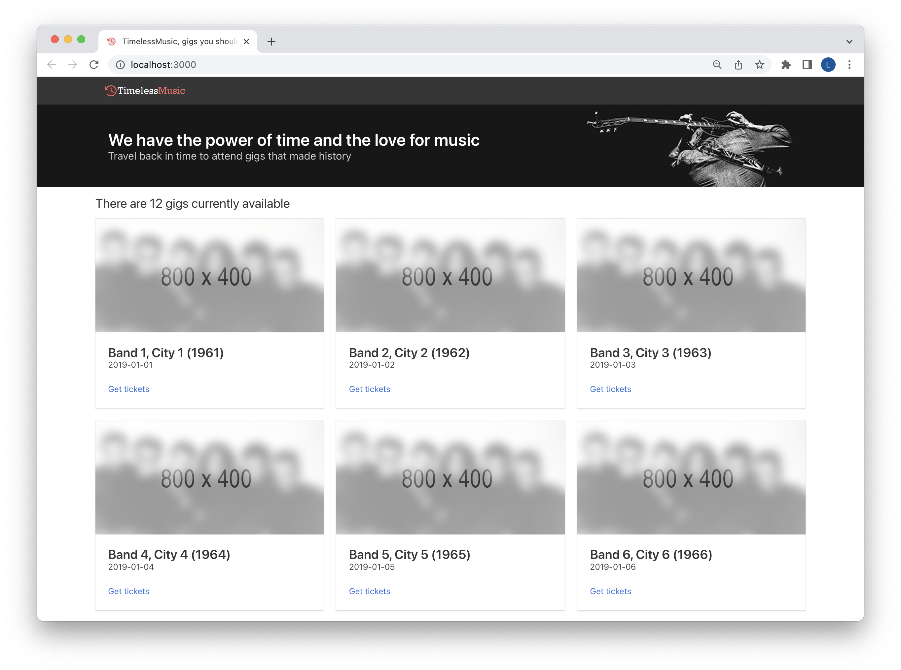

# 01 - Deploying the frontend

## Goals

In this lesson we will learn the basics of S3 and how to deploy a Single Page Application (our e-commerce frontend) using S3.

During this lesson, we will learn:

  - How to use the AWS CLI
  - How to create an S3 bucket
  - How to copy files into the bucket
  - How to expose the content of the bucket as a public website
  - The basics of AWS policies
  - How to configure a policy for making all the objects in a bucket public


## Before getting started

Before getting started make sure to:

  1. Have installed all the dependencies and configured them as mentioned in the [`README.md`](/README.md) 
  2. Clone this repository locally
  3. Run `npm install` (at the root of the project)


## The frontend

We have already a frontend application developed as a Single Page Application (SPA).

The code is available in the [`frontend`](/frontend/) folder.

You can run a preview of the website on your machine by running:

```bash
npm run dev --workspace=frontend -- --open
```

Once you do that, you should see something similar to the following screenshot:



Feel free to browse around to get a feeling for what the app looks like and what it's supposed to do.

Don't worry if all the data looks _fake_. We are using mock data for now. We don't have a database and a set of APIs, just yet. We'll add those later!

The frontend is already designed to work either with mock data or with an API. When we we'll have our API ready and deployed we will configre the frontend to use that.

Don't worry if you are not a frontend expert, you are not required to be one to continue with this workshop.


### Building the frontend

The frontend application is written in React, so we need to build it before we can publish it.

To do that just run (from the root folder):

```bash
npm run build --workspace=frontend
```

If all goes well, all the files we need are now available in `frontend/dist`.


Let's now try to deploy this frontend to AWS!


## S3

We will deploy our frontend to S3.

S3 stands for **Simple Storage Service**. It's a storage service designed to host large amounts of data in a simple and reliable fashion.

Data is stored in the form of **objects** (effectively files) and it's organised into **buckets** (effectively like independent drives). Every object in a bucket is identified by a unique **key** (effectively like a path in a file system).

The following table recaps the main concepts to know about S3:

| **S3**     | **File System** analogy     |
|------------|-----------------------------|
| **Bucket** | Drive                       |
| **Object** | File on the drive           |
| **Key**    | Path of a file on the drive |


S3 can also expose the content of a bucket as a website.

Our goal is to copy all the static files from `frontend/dist` into an S3 bucket and then expose them using the S3 website feature.

At that point we should have a public URL that we (and everyone else really) can use to look at our website.


## Create a bucket

The first thing that we need to do is to create an S3 bucket into our AWS account.

An S3 bucket can be named by following the same conventions of DNS names, which means you can use lowercase letters, numbers, hyphens and dots (more details [here](http://docs.aws.amazon.com/AmazonS3/latest/dev/BucketRestrictions.html)).

Also, like domain names, bucket names need to be unique (across all AWS accounts!), so we need to be careful and avoid collisions.

To create a bucket in your account you can run the following command:

```bash
export FRONTEND_BUCKET=timelessmusic-frontend-$(head /dev/urandom | env LC_CTYPE=C tr -cd 'a-z0-9' | head -c 6)
aws s3 mb s3://$FRONTEND_BUCKET
```

> **Note**: `mb` stands for _Make Bucket_

> **Note**: with the first command we create a random name for the bucket using a sequence of shell commands (to minimize the likelihood that somebody else has already reserved that name). Of course, if you prefer you can leave out the randomness and try to pick a unique name yourself like: `timelessmusic-frontend-for-unicorns`.

> **Note**: we also exported the generated bucket name in an environment variable called `FRONTEND_BUCKET`. So we can reference that in this terminal session in the future. For example, try running `echo $FRONTEND_BUCKET` in your terminal!

The script above will output something like this:

```plain
make_bucket: timelessmusic-frontend-abcdef
```

To verify that the bucket is there we can run:

```bash
aws s3 ls
```

This command will list all the buckets created in your account in your default region. Make sure you see the bucket you should have just created!


## Copy files to the bucket

There are several ways to copy files from the local file system as objects into an S3 bucket. The simplest one is to use the `aws s3 cp` command:

```bash
aws s3 cp frontend/dist "s3://$FRONTEND_BUCKET" --recursive
```

> **Note**: the AWS CLI is organised into sub-commands at multiple level. The first level is generally the name of the AWS service you are interacting with (in this case `s3`). Every service has its own additional sub-commands to perform actions against that service (in this case `cp`).

If everything worked as expected you should see the command printing the list of files that are being copied into S3.

We can list all the files in a bucket with the following command:

```bash
aws s3 ls "s3://$FRONTEND_BUCKET" --recursive
```

Make sure to have an `index.html` and a few folders with files like `assets`, `images` and `mocks`.


> **Note**: another way to copy files into an S3 bucket is to use the [sync](http://docs.aws.amazon.com/cli/latest/reference/s3/sync.html) command. This one is more convenient where you have already copied most files and just want to synchronise the files that have changed since the last copy.


## Expose the bucket as a website

S3 allows you to expose all the objects within a bucket as a static files web server. This means that you'll get a public facing URL for every single object in the bucket.

This is just a quick and easy way to host our Single Page Application on the public internet.

To enable website capabilities on our bucket we can run the following command:

```bash
aws s3 website "s3://$FRONTEND_BUCKET/" --index-document index.html --error-document index.html
```

> **Note**: `--index-document` defines which file is used as a default file (home page), while `--error-document` defines which file is returned when we are trying to access a file that does not exist in the bucket. The reason why we use `index.html` here again, is because our application uses client side routing. So `index.html` we'll always start the application, then on the client side the application will load the necessary page (if it exists) or show an error message (if that route does not exist).

Once we have enabled website mode on our bucket we can discover the public URL of the website with the following command:

```bash
echo "http://$FRONTEND_BUCKET.s3-website-eu-west-1.amazonaws.com"
```

> **Warning**: the command above is assuming your bucket lives in the `eu-west-1` region. If that's not the case, make sure to replace that with your actual region.


## Bucket policies

At this point if we try to open that URL we will see a nasty error message:

TODO: Add actual error message or image...

This is because even if we have enabled the website capabilities, by default, all the objects in the bucket are **private** and the website cannot serve private objects.

We will discuss this more during this workshop, but in general, AWS takes a very conservative approach when it comes to security: almost everything is private or disabled unless we explicitly configure things otherwise.

The way we can provide this configuration to AWS is through policies.

Let's see the policy that can allow us to make all the objects in our bucket public:

```json
{
  "Version": "2012-10-17",
  "Statement": [
    {
      "Effect": "Allow",
      "Principal": "*",
      "Action": [
        "s3:GetObject"
      ],
      "Resource": [
        "arn:aws:s3:::<FRONTEND_BUCKET>/*"
      ]
    }
  ]
}
```

> **Warning**: be sure to replace `<FRONTEND_BUCKET>` in the policy content with your actual bucket name (e.g. `"arn:aws:s3:::<FRONTEND_BUCKET>/*"` -> `"arn:aws:s3:::timelessmusic-frontend-abcdef/*"`).

Let's dissect this policy document to understand what its component mean:

  - `Version` defines the policy document version (this is pretty much a copy/paste all the time and you don't have to worry about this too much)
  - `Effect`: can be `Allow` or `Deny`. In this case we want to _enable_ a specific behaviour, so we go for `Allow`.
  - `Principal`: TODO: explain the concept of principal
  - `Action`: an array containing one or more actions. An action is generally a capability of a service and it comes in the form `service:Capability`. In our case we want to refer to the ability of _getting objects from S3_, so we use `s3:GetObject`.
  - `Resource`: capabilities often have an effect on specific resources. In our case we are trying to enable `s3:GetObject` but on which resources (which bucket and which objects)? We can specify those resources here as an array with one or more elements. Every element is an **ARN** (Amazon Resource Name) expression. We can use `*` to indicate a class of ARNs. In this case `arn:aws:s3:::<FRONTEND_BUCKET>` is the ARN of the bucket and with `arn:aws:s3:::<FRONTEND_BUCKET>/*` we are indicating **all the object in that bucket**.

> **Note**: almost every resource on AWS is identified by a unique ARN.

If we save the policy document above in a file called `policy.json` in the local folder, we can then apply this policy to our bucket with the following command:

```bash
aws s3api put-bucket-policy --bucket $FRONTEND_BUCKET --policy file://policy.json
```

Now try to refresh the browser pointing to our public website and hopefully this time you'll see something different! 🤞


## What about HTTPS?

You might have noticed this warning on the URL bar while opening the website:

TODO: add picture of unsafe warning from Chrome.

This is because S3 website only exposes the website over HTTP and it does not support HTTPS.

This is sub-optimal for us (we are building an e-commerce after all), but, in the spirit of keeping things simple in this workshop, we will ignore this issue for now and proceed with HTTP only.

> **Note**: If you really want to enable HTTPS while serving static assets from an S3 bucket, this is something that can be done with a service called [CloudFront](https://aws.amazon.com/cloudfront/).


## Verify

If you followed all the instruction correctly up to this point, you should now have a functioning frontend showing some mock data running in your bucket website.

Try to navigate all the different sections and make sure everything seems to work smoothly.

Finally, try to input a random url to see if the 404 page works as it should.

Now we are ready to start exploring how to host some real data on a cloud database like DynamoDB: let's get ready for the [next lesson](/lessons/02-setting-up-dynamodb/README.md)!


---

| [⬅️ 00 - README](/README.md) | [🏠](/README.md)| [02 - Setting up DynamoDB ➡️](/lessons/02-setting-up-dynamodb/README.md)|
|:--------------|:------:|------------------------------------------------:|
