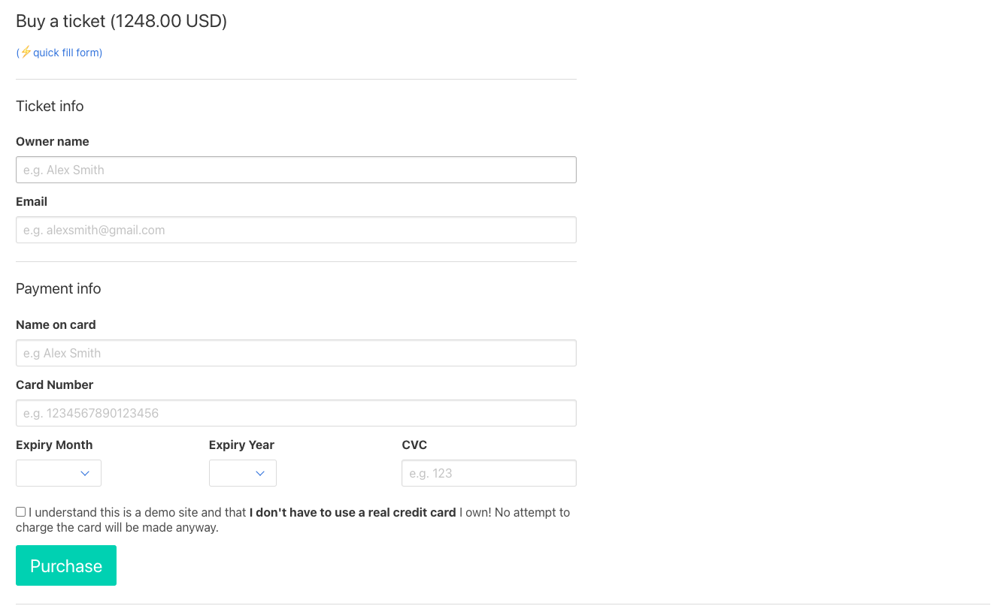
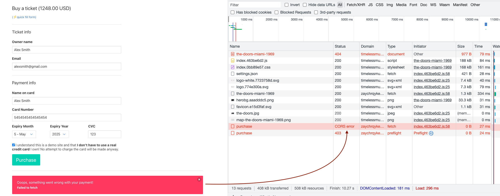
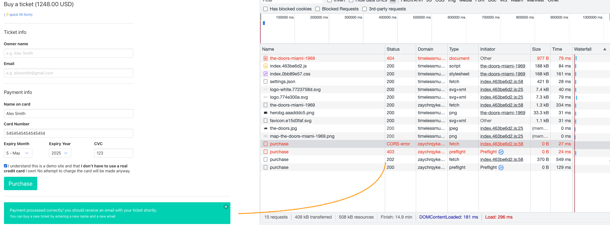

# 06 - Purchase API

### Goals

In this lesson we will learn how to create an API that receives data through an HTTP POST request

In particular we will learn:

  - How to write Lambda APIs that can receive POST data
  - How to validate and process the request
  - How to deal with CORS in Lambda and API Gateway


## 06.02 - API for tickets purchase

A big part of our application is to be able to sell tickets for the gigs (everyone wants to make money, right? 🤑).

In every gig page, the frontend already displays a form to buy tickets at the bottom of the page.



When you fill the form and hit the *Purchase* button, the frontend will submit the data to an API located in `/purchase` with a `POST` request.

In this section we will implement the Lambda function for this endpoint.

### API specification

The purchase ticket API expects as input (request body) a JSON string representing an object with the following attributes:

  - `gigId`: (`string` | `required`) the id of the gig for which the ticket is being purchased
  - `name`: (`string` | `required`) the name and surname of the ticket owner
  - `email`: (`string` | `required`) the email of the ticket owner
  - `nameOnCard`: (`string` | `required`) the name of the card owner
  - `cardNumber`: (`string` | `required`) the credit card number to charge for the ticket
  - `cardExpiryMonth`: (`string` | `required`) a value between 1 and 12 representing the expiry month of the credit card
  - `cardExpiryYear`: (`string` | `required`) a value representing the expiry year of the credit card
  - `cardCVC`: (`string` | `required`) 3 or 4 digits representing the CVC of the credit card
  - `disclaimerAccepted`: (`boolean` | `required`) a boolean flag that must be set to `true` to indicate that the user accepted the terms and conditions of the payment.

The body of a valid request payload would look like the following JSON:

```json
{
  "gigId":"joy-division-london-1979",
  "name":"Alex Smith",
  "email":"alexsmith@gmail.com",
  "nameOnCard":"Alex Smith",
  "cardNumber":"5454545454545454",
  "cardExpiryMonth":"5",
  "cardExpiryYear":"2020",
  "cardCVC":"123",
  "disclaimerAccepted":true
}
```

The API we want to implement needs to process the input, verify that it's a valid JSON and validate every field.

  - If everything is OK the API will return a `202 Accepted` with body `{"success": true}`.

  - If the request body is not a valid JSON it should a `400 Bad Request` with body `{"error": "Invalid content, expected valid JSON"}`

  - If one or more fields are missing or are not valid the API should respond with a `400 Bad Request` with a JSON body containing a description of the error as per the following example:
  ```json
  {
    "error": "Invalid request: missing or invalid field \"email\""
  }
  ```

> **Warning**: our implementation of the API must not attempt to charge the given credit card but, for the sake of this tutorial, only checks if the format looks valid. Be good, **NO MONEY SHOULD BE TAKEN** from the given credit card (for now) 😇

You can try to update the code in `backend/app.ts` to implement this logic. Here's a template you can use:

```ts
type BuyTicketFormData = {
  gigId: string,
  name: string,
  email: string,
  nameOnCard: string,
  cardNumber: string,
  cardExpiryMonth: string,
  cardExpiryYear: string,
  cardCVC: string,
  disclaimerAccepted: boolean,
}

export async function purchase (event: APIGatewayProxyEvent) : Promise<APIGatewayProxyResult> {
  let data: BuyTicketFormData

  try {
    // parse request body as JSON
    data = JSON.parse(event.body)
  } catch (err) {
    // TODO ... if it fails to parse the json you should return a 404
  }

  // TODO ... Do some lightweight validation and make sure all the fields are present and that `disclaimerAccepted` is true
  const errors = []
  // ...

  if (errors.length) {
    // TODO ... there are errors, return a 400 error
  }

  // ALL GOOD
  // TODO ... return a 202 response
}
```

TODO: mention solution if you get lost

TODO: mention how to test the solution locally


## Exposing the new API in the template

When you are happy with the implementation of the API, you have to expose the API in API Gateway through the `template.yml`:

```yaml
# ...

Resources:

  # ...

  purchase:
    Type: AWS::Serverless::Function
    Properties:
      CodeUri: ./
      Handler: app.purchase
      Events:
        Endpoint:
          Type: Api
          Properties:
            Path: /purchase
            Method: post
    Metadata:
      BuildMethod: esbuild
      BuildProperties:
        Minify: true
        Target: "es2020"
        Sourcemap: true
        EntryPoints:
          - app.ts
```

At this point, we are ready to build and deploy the new version of our Application:

```bash
sam build && sam deploy
```


## Enabling CORS for non-GET requests

It's now time to go to our frontend and try to purchase a ticket.

If you did everything correctly in the previous steps, you should see... this error! 😅



This errors happens as part of the CORS protocol.

> 💡 **TIP**: CORS stands for [Cross-Origin Resource Sharing](https://developer.mozilla.org/en-US/docs/Web/HTTP/CORS)

When some JavaScript code in the browser invokes an XHR request to another domain, the browser might issue a [Pre-Flight request](https://developer.mozilla.org/en-US/docs/Glossary/Preflight_request) to check if the destination API can receive call from the current domain (the one where the website originating the request is running).

During Pre-flight the browser sends an OPTIONS request before your actual request gets sent. The browser expects to receive as response to this request a set of headers that specify which domains can invoke the API, which headers ('Content-Type', etc.) can be sent and which HTTP methods (POST, PUT, etc.) can be used. These are often called *"Access Control rules"*. These headers are validated against the current request and if it matches the given rules, then the original request is actually performed.

> **Note**: If you need more detail on how CORS actually works, check out this brilliant article: [Understanding CORS and Pre-Flight](http://www.authenticdesign.co.uk/understanding-cors-and-pre-flight/)

In order to make our API work, we need to add CORS support to our application.

The easiest way to do this is to expand our `Global` configuration in the `template.yaml` and add a piece of specific CORS configuration:

```yaml
# ...

Globals:
  Function:
    Timeout: 3
    Runtime: nodejs16.x
  Api:
    Cors:
      AllowMethods: "'GET,POST,OPTIONS'"
      AllowHeaders: "'DNT,User-Agent,X-Requested-With,If-Modified-Since,Cache-Control,Content-Type,Range'"
      AllowOrigin: "'http://<FRONTEND_BUCKET>.s3-website-<AWS_REGION>.amazonaws.com'"

# ...
```

> **Warning**: Be sure to replace `<FRONTEND_BUCKET>` and `<AWS_REGION>` with your actual values.

> **Note**: You might have noticed that we are *double quoting* the attribute values (`"'some value'"`), this is because the HTTP spec requires the value of these header properties to be quoted strings.

Now we are ready to deploy our app again:

```bash
sam build --beta-features && sam deploy
```

At this stage, when we test our purchase form again we should see a nice green success message 🤑:




## Verify

If you did everything correctly you should now have the purchase form working.

You can easily test it by visiting a gig page and by filling the form (you can use the *quick fill form* to speed up the process).

If you see a green success message saying that the payment was processed correctly you can be happy and move to the next lesson!


## Summary

TODO: ...


---

| [⬅️ 05 - API with DynamoDB](/lessons/05-api-with-dynamodb/README.md) | [🏠](/README.md)| [07 - SQS and Lambda workers ➡️](/lessons/07-sqs-lambda-worker/README.md)|
|:--------------|:------:|------------------------------------------------:|