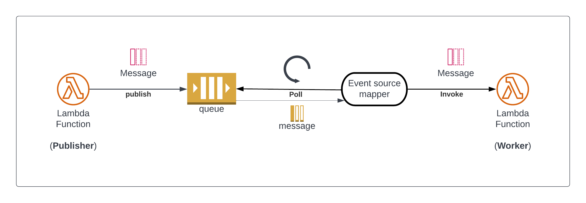

# 07 - Send messages to SQS

## Goals

In this lesson we will learn how to send messages to an SQS queue: the first step to be able to process background tasks (like sending a confirmation email).

In particular we will discuss:

  - What SQS is
  - How to create an SQS queue
  - How to give permissions to a Lambda to send messages to a queue
  - How to share the queue URL to a Lambda using environment variables
  - How to send messages to SQS using the AWS SDK
  - How to update our purchase API to send a message to SQS once a purchase has been completed


## SQS (Simple Queue System)

SQS (Simple Queue System) is a fully managed message queuing service that makes it easy to decouple and scale microservices, distributed systems, and serverless applications.

You can use it to queue units of work can be performed asynchronously by one or more workers. Workers will periodically interrogate (pull from) the queue to see if there's work to do and report to the queue once some task is completed, so that no other work will try to perform it again.

An SQS queue can invoke a Lambda every time that new messages are available in the queue. This is possible thanks to an AWS component called [event source mapping](https://docs.aws.amazon.com/lambda/latest/dg/invocation-eventsourcemapping.html).

An event source mapper polls a poll-based resource (like an SQS queue) and invokes a Lambda every time that there's new data available.

This is the high level architecture we want to implement:



  1. A lambda publish a message to an SQS queue
  2. The queue persistently stores the message and waits for someone to poll
  3. The event source mapper polls the queue for new messages
  4. When a new message is retrieved, the event source mapper invokes a Lambda worker and pass the message as part of the event

This architecture allows us to decouple the work of the API (validating a payment and finalising a purchase) from the role of sending a confirmation email to the user (job delegated to the background worker lambda).

This allows our API to respond quickly without having to wait in line for an expensive operation (like sending an email).


## Creating an SQS queue

Let's start by creating the queue that we are going to use.

This time, rather than creating the queue from the CLI (like we did for our S3 bucket and our DynamoDB table), we will use SAM (and CloudFormation behind the scenes) to create the queue. This way we are following the principles of infrastucture as code and defining a component of our architecture (the queue) together with the configuration of the application.

> **Note**: It's generally a good practice in the cloud to define every single resource using the principles of infrastructure as code.

In order to define an SQS queue we need to add the following code in our `template.yml` under the `Resources` section:

```yaml
ticketPurchasedQueue:
  Type: "AWS::SQS::Queue"
  Properties:
    QueueName: "timelessmusic-purchase"
```

TODO: ...

TODO: pass the queue URL to the `purchase` lambda using environment variables (`Environment` under `Properties`)

```yaml
Environment:
  Variables:
    SQS_QUEUE_URL: !Ref "ticketPurchasedQueue"
```

TODO: configure lambda policy to be able to write to SQS:

```yaml
Policies:
  - Statement:
      - Sid: PurchaseAllowSQSSendMessage
        Effect: Allow
        Action:
          - sqs:SendMessage
        Resource: !GetAtt "ticketPurchasedQueue.Arn"
```

TODO: see the queue URL after a deployment:

```yaml
Outputs:
  # ...
  queueUrl:
    Description: The URL of the ticket purchase queue
    Value: !Ref "ticketPurchasedQueue"
    Export:
      Name: timelessmusic:sqs-queue
```

## Send messages to SQS using the SDK

The first thing we need to do is to install the SQS client:

```bash
npm i --save @aws-sdk/client-sqs
```

This client works in a very similar way to the DynamoDB client we explored previously.

To get a flavour of how it looks like, here's a quick snippet:

```js
import { randomUUID } from 'crypto'
import { SQSClient, SendMessageCommand } from '@aws-sdk/client-sqs'

// we get the queue url from an environment variable
const queueUrl = process.env.SQS_QUEUE_URL

// some structured data you want to send to SQS
const message = { ticketId: randomUUID() }

// we create an SQS client
const client = new SQSClient({})
// a send message command
const sendMessageCommand = new SendMessageCommand({
  MessageBody: JSON.stringify(purchaseData),
  QueueUrl: process.env.SQS_QUEUE_URL
})

// then we send the command through the client
await client.send(sendMessageCommand)
```

This is all you need to know to be able to send messages to SQS from the `purchase` Lambda function.


## Update the purchase lambda code

Now let's use what we learned before to update our `purchase` Lambda code.

Ideally we want to send a message to SQS that contains the following information:

  - `name`: the name of the ticket owner
  - `email`: the email of the ticket owner
  - `gigId`: The unique id of the gig
  - `ticketId`: a uniquely generated ticket id (you can use `randomUUID()` to generate that)

This should be enough information for us to be able to send an email to the user from our worker.

We should send this message to SQS only before sending a successful response (202), so in case of error, we should not do that!

You can use this template as a reference to update the code of the `purchase` function:

```ts
// app.ts

// ...

export async function purchase (event: APIGatewayProxyEvent) : Promise<APIGatewayProxyResult> {
  let data: BuyTicketFormData

  try {
    data = JSON.parse(event.body)
  } catch (err) {
    // ...
  }

  // ... Validate data (skipped) ...

  const ticketId = randomUUID()
  const purchaseData = {
    name: data.name,
    email: data.email,
    gigId: data.gigId,
    ticketId
  }

  // TODO ... Add here the code to send the `purchaseData` as a message to SQS

  return {
    statusCode: 202,
    headers: {
      'content-type': 'application/json',
      'Access-Control-Allow-Origin': '*'
    },
    body: JSON.stringify({ ticketId })
  }
}
```

If you are struggling to see how to update the code you can find a solution in [`app.ts`](./app.ts) in this lesson's folder.


Once you are done let's build and validate our SAM template:


```bash
sam build --beta-features && sam validate
```

Finally, if all went well, let's deploy the changes:

```bash
sam deploy
```


## Verify

If everything went all right, you can now go back to the frontend and purchase a new ticket!

Of course there's a command to check if messages are accumulating in the queue.

Given that you already know the queue URL from the last step:

```bash
aws sqs get-queue-attributes --attribute-names "ApproximateNumberOfMessages" --queue-url <url_of_your_queue>
```

> **Warning**: make sure to replace `<url_of_your_queue>` with the actual queue URL from SAM output


This should output something like:


```json
{
  "Attributes": {
    "ApproximateNumberOfMessages": "0"
  }
}
```

The number of messages should increase if you keep purchasing new tickets!


## Summary

TODO: ...


---

| [⬅️ 06 - Purchase API](/lessons/06-purchase-api/README.md) | [🏠](/README.md)| [08 - Worker lambda ➡️](/lessons/08-worker-lambda/README.md)|
|:--------------|:------:|------------------------------------------------:|
